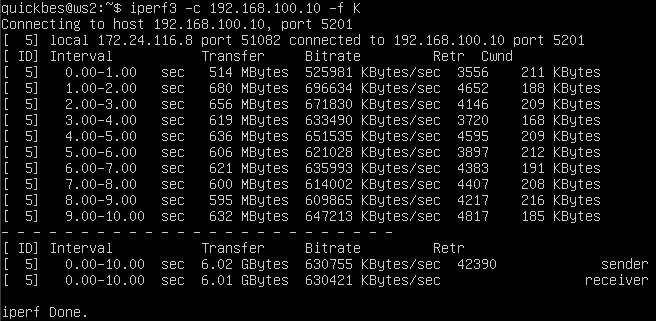
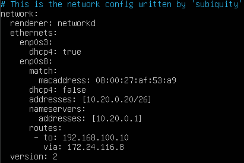

# Отчёт по DO2. Сети в Linux

## Оглавление

   1. [Инструмент ipcalc](#part-1-инструмент-ipcalc)
   2. [Статическая маршрутизация между двумя машинами](#part-2-статическая-маршрутизация-между-двумя-машинами)
   3. [Утилита iperf3](#part-3-утилита-iperf3)
   4. [Сетевой экран](#part-4-сетевой-экран)
   5. [Статическая маршрутизация сети](#part-5-статическая-маршрутизация-сети)
   6. [Динамическая настройка IP с помощью DHCP](#part-6-динамическая-настройка-ip-с-помощью-dhcp)
   7. [NAT](#part-7-nat)
   8. [Знакомство с SSH Tunnels](#part-8-знакомство-с-ssh-tunnels)

## Part 1. Инструмент ipcalc

**Поднял первую виртуальную машину *ws1*:**


### 1.1. Сети и маски

**Установил утилиту ipcalc через `sudo apt install ipcalc`.**

1. Для определения адреса сети **192.167.38.54/13**, вводим `ipcalc 192.167.38.54/13`, 
полученный адрес - **192.160.0.0/13 :**


2. Маска **255.255.255.0** переводится через `ipcalc 255.255.255.0`, и будет иметь вид: в префиксной записи - **/24**, 
в двоичной записи - **11111111.11111111.11111111. 00000000 :**


**/15** переводится через `ipcalc /15` и будет иметь вид: в обычной форме - **255.254.0.0**, 
в двоичной - **11111111.11111110.00000000. 00000000 :** 


**11111111.11111111.11111111.11110000** переводится в обычную запись через перевод из двоичной системы в десятичную,
и выглядит, как: **255.255.255.240**, и префиксную переводится по формуле: *32 - n, где n - число нулей в маске*, 
и выглядит, как: **/28 .**

3. Минимальный и максимальный хост в сети 12.167.38.4 при масках определяются через `ipcalc 12.167.38.4/mask`, 
и будут иметь следующие значения: 
- /8 - **HostMin: 12.0.0.1, HostMax: 12.255.255.254**;
- 11111111.11111111.00000000.00000000 (*255.255.0.0*) - **HostMin: 12.167.0.1, HostMax: 12.167.255.254**; 
- 255.255.254.0 - **HostMin: 12.167.38.1, HostMax: 12.167.39.254**;
- /4 - **HostMin: 0.0.0.1, HostMax: 15.255.255.254**.


### 1.2. localhost

Диапазон адресов *localhost*: **127.0.0.1 - 127.255.255.254 .**
В этот диапазон попадают адреса: **127.0.0.2, 127.1.0.1** - по ним можно обратиться.
Адреса: **128.0.0.1 и 194.34.23.100** - не попадают, по ним обратиться нельзя.

### 1.3. Диапазоны и сегменты сетей

1. Под частные (они же локальные сети) сети зарезервированы следующие диапазоны адресов:

- 10.0.0.0 — 10.255.255.255 (10.0.0.0/8);
- 172.16.0.0 — 172.31.255.255 (172.16.0.0/12);
- 192.168.0.0 — 192.168.255.255 (192.168.0.0/16);
- 127.0.0.0 — 127.255.255.255 (зарезервировано для петлевых интерфейсов (не используется для обмена между узлами сети), т. н. localhost).

Отсюда, в качестве частных IP можно использовать следующие адреса: **10.0.0.45, 192.168.4.2, 172.20.250.4, 172.16.255.255, 10.10.10.10.**
А в качестве публичных: **134.43.0.2, 172.0.2.1, 192.172.0.1, 172.68.0.2, 192.169.168.1.**

2. У сети **10.10.0.0/18** возможны следующие IP-адреса шлюзов (*определяются по соответствию маске*): **10.10.0.2, 10.10.10.10, 10.10.1.255.**


## Part 2. Статическая маршрутизация между двумя машинами

- Поднял две виртуальные машины *ws1* и *ws2*.

- С помощью команды `ip a` посмотрел существующие сетевые интерфейсы:


**В каждой машине есть по два интерфейса:**
- **lo** - стандартный интерфейс, нужен для работы локальных сервисов и приложений по сетевым протоколам;
- **enp0s3** - интерфейс адаптера, подключен к сети по протоколу dhcp в режиме NAT.


- Для работы с сетевым интерфейсом внутренней сети необходимо выключить виртуальную машину и перейти в раздел 
*Настройки->Сеть->Адаптер 2*. Далее включаем функцию **Включить сетевой адаптер**. 
В разделе **Тип подключения** выбираем **Внутренняя сеть**. **Имя:** intnet.


- Повторяем действия *описанные выше* со второй машиной.


- Открыл конфигурационный файл сети через `sudo nano /etc/netplan/*.yaml` на обеих машинах и задал необходимые параметры в строке **addresses:**

**ws1**


**ws2**


- Выполнил команду `sudo netplan apply` для перезапуска сервиса сети на обеих машинах.

### 2.1. Добавление статического маршрута вручную

**ws1**

- Проверяем отсутствие маршрута на вторую машину через `ip r`.
- Добавляем статический маршрут на машину **ws2** через `sudo ip r add 172.24.116.8 dev enp0s8`.
- Проверяем наличие добавленного маршрута через `ip r`:


**ws2**

- Проверяем отсутствие маршрута на первую машину через `ip r`.
- Добавляем статический маршрут на машину **ws1** через `sudo ip r add 192.168.100.10 dev enp0s8`.
- Проверяем наличие добавленного маршрута через `ip r`:


- Пропинговал вторую машину через `ping -c 3 172.24.116.8`:


- Пропинговал первую машину через `ping -c 192.168.100.10`:


- Перезапустил обе машины с помощью команды `reboot`.


- Открыл конфигурационный файл сети **ws1** и добавил туда маршрутизацию через строку `routes` с **ws1** на **ws2**:


- Открыл конфигурационный файл сети **ws2** и добавил туда маршрутизацию через строку `routes` с **ws2** на **ws1**:


- Перезапустил сервис сети на обеих машинах через `sudo netplan apply`.

- Пропинговал обе машины через `ping -c ip_address`:


## Part 3. Утилита iperf3

### 3.1. Скорость соединения

```
Перевод скоростей соединения:
- 8 Mbps = 1 MB/s
- 100 MB/s = 819200 Kbps
- 1 Gbps = 1024 Mbps
```

- Установил утилиту **iperf3** через `sudo apt install iperf3`.

- Запустил утилиту в режиме сервера, и с единицами *Кбайт* через `iperf3 -s -f K` на машине **ws1**:


- Запустил утилиту в режиме клиента и подключился к серверу **ws1** через `iperf3 -c 192.168.100.10 -f K`:  




## Part 4. Сетевой экран

### 4.1 Утилита iptables

- Создал файл, имитирующий фаерволл через `sudo nano /etc/firewall.sh` и открыл его для редактирования на обоих машинах:

**firewall.sh на *ws1***


**firewall.sh на *ws2***


- Запустил файлы фаерволла на обеих машинах командами `sudo chmod +x /etc/firewall.sh` и `sudo bash /etc/firewall.sh`:

**Машина *ws1***


**Машина *ws2***


```
Разница между стратегиями в файлах: при составлении цепочек правил в iptables важна очередность этих правил. 
Так, флаг -А добавлает правило в конец цепочки. 
Правила,находящиеся выше по цепочке более приоритетны и исполняются в первую очередь. 
Поэтому для ws1 все входящие пакеты (в том числе ping) отклоняются, а на ws2 принимаются.
```


### 4.2 Утилита nmap

- Установил утилиту **nmap** через `sudo apt install nmap`.

- Пропинговал вторую машину через `ping -c 4 172.24.116.8` и проверил её состояние через `sudo nmap 172.24.116.8`:


- Пропинговал первую машину через `ping -c 4 192.168.100.10` и проверил её состояние через `sudo nmap 192.168.100.10`:


```
ws1 - OUTPUT для пакетов на ping-reply DROP - не работает т.е. пакеты отправляет, но не принимает.*
ws2 - OUTPUT для пакетов на ping-reply ACCEPT - работает.
```


## Part 5. Статическая маршрутизация сети

- Создал ещё 3 виртуальные машины путем клонирования:


- Вносим изменения для каждой из машин в VirtualBox:

**Настройка адаптеров для машины *r1***


**Настройка адаптеров для машины *r2***


**Настройка адаптеров для машины *ws11***


**Настройка адаптеров для машины *ws21***


**Настройка адаптеров для машины *ws22***


- Настроил конфигурацию сети на машинах через `sudo nano /etc/netplan/*.yaml`.
- Применил настройки конфигурации через `sudo netplan apply`:

**Машина *r1*** 


**Машина *r2***


**Машина ws11** 


**Машина ws21**


**Машина ws22**




- Командой `ip -4 a` проверил, что адреса машин заданы верно:

**Машина *r1*** 


**Машина *r2***


**Машина ws11** 


**Машина ws21**


**Машина ws22**


- Пропинговал *ws22* с *ws21*. Аналогично пропинговал *r1* с *ws11*:


### 5.2. Включение переадресации IP-адресов

- Для включения переадресации IP, на роутерах (*r1, r2*) выполнил команду `sudo sysctl -w net.ipv4.ip_forward=1` 
(*работает до перезагрузки*):


- Открыл на роутерах файл `/etc/sysctl.conf` и добавил в него следующую строку `net.ipv4.ip_forward=1`
(*при использовании этого подхода, IP-переадресация включена на постоянной основе*):

**Машина *r1***


**Машина *r2***


### 5.3. Установка маршрута по умолчанию

**Настройка маршрута по-умолчанию (шлюза) для рабочих станций(ws11, ws22, ws21):**

- Внёс изменения для каждой из машин с помощью команды `sudo nano /etc/netplan/*.yaml`:

**Машина *ws11***


**Машина *ws21***


**Машина *ws22***


- Вызвал команду: `ip r` и проверил, что маршрут добавлен в **таблицу маршрутизации:**

**Машина *ws11***


**Машина *ws21***


**Машина *ws22***


- Пропинговал с *ws11* роутер *r2* и проверил на *r2*, что пинг проходит, используя команду: `tcpdump -tn -i eth0`:


### 5.4. Добавление статических маршрутов

- Добавил правило *routes* в netplan *r1*:


- Добавил правило *routes* в netplan *r2*:


- Применил настройки конфигурации через `sudo netplan apply` и перезагрузил оба роутера через `reboot`.

- Вызвал команду `ip r`, чтобы отобразить **таблицы с маршрутами** на обоих роутерах:

**r1**


**r2**


- Запустил на *ws11* команды: `ip r list 10.10.0.0/[маска сети]` и `ip r list 0.0.0.0/0`:


```
Для адреса 10.10.0.0/18 был выбран маршрут, отличный от 0.0.0.0/0, 
потому что при наличии нескольких маршрутов одинаковой длины выбирается тот маршрут, который задан наиболее точно.
```


### 5.5. Построение списка маршрутизаторов

- Запустил на *r1* команду *дампа*: `tcpdump -tnv -i eth0`:


- При помощи утилиты `traceroute` построил список маршрутизаторов на пути от *ws11* до *ws21*: `traceroute [адрес сети]`:


```
Команда traceroute linux использует UDP пакеты. Она отправляет пакет с TTL=1 и смотрит адрес ответившего узла, 
дальше TTL=2, TTL=3 и так пока не достигнет цели. 
Каждый раз отправляется по три пакета и для каждого из них измеряется время прохождения. 
Когда утилита получает сообщение от целевого узла о том, что порт недоступен трассировка считается завершенной.
```


### 5.6. Использование протокола ICMP при маршрутизации

- Запустил на *r1* перехват сетевого трафика, проходящего через адаптер *eth0* с помощью команды `tcpdump -n -i eth0 icmp`:


- Пропинговал с *ws11* несуществующий IP с помощью команды `ping -c 1 10.30.0.111`:


## Part 6. Динамическая настройка IP с помощью DHCP

- Установил *isc-dhcp-server* через `sudo apt install isc-dhcp-server`.

- Для *r2* настроил в файле `/etc/dhcp/dhcpd.conf` **конфигурацию службы DHCP**:

1. Указал адрес маршрутизатора по-умолчанию, DNS-сервер и адрес внутренней сети:


2. В файле `resolv.conf` прописал строку `nameserver 8.8.8.8`:


3. Перезагрузил службу *DHCP* командой `systemctl restart isc-dhcp-server`:


4. Машину *ws21* перезагрузил при помощи `reboot` и через `ip a` проверил, что она получила адрес:


5. Пропинговал *ws22* с *ws21*:


- Указал новый MAC адрес у *ws11*, для этого поменял MAC у сетевого адаптера в настройках VB, 
а затем в `etc/netplan/00-installer-config.yaml` заменил текущий MAC, 
с помощью добавления строк: `macaddress: 10:10:10:10:10:BA` и `dhcp4: true`:


- Роутер *r1* настроил аналогично *r2*, но сделал выдачу адресов с жесткой привязкой к MAC-адресу (*ws11*):

- В файле `/etc/dhcp/dhcpd.conf` настроил конфигурацию службы DHCP: 
указал адрес маршрутизатора по-умолчанию, DNS-сервер и адрес внутренней сети:


- В файле `/etc/resolv.conf` прописал `nameserver 8.8.8.8`:


- Перезапустил службу DHCP командой `systemctl restart isc-dhcp-server`:


- Провёл аналогичные тесты для машины *r1*:


- Пропинговал *ws22* с *ws11*:


- Вывел текущий IP у машины *ws21* через `ip a`:


- Принудительно освободил IP-адрес DHCP-клиента с помощью команды  `sudo dhclient -r [адаптер]`.
- Получаем новый IP-адрес с помощью DHCP с помощью команды `sudo dhclient [адаптер]`:


- Проверил, что IP-адрес изменился через `ip a`:


**Какими опциями DHCP сервера пользовался в данном пункте:**
1. Настройка конфигурации службы DHCP (адрес маршрутизатора по-умолчанию, DNS-сервер, адрес внутренней сети, привязка к MAC-адресу);
2. Клиент протокола динамической конфигурации хоста (команда `dhclient`) для получения и освобождения IP-адреса.


## Part 7. NAT

- Устанавливаем сервер **Apache2** командой `sudo apt install apache2`.

- В файле `/etc/apache2/ports.conf` на *ws22* и *r1* изменил строку `Listen 80` на `Listen 0.0.0.0:80`, 
то есть сделал сервер **Apache2** общедоступным:

**ws22**


**r1**


- Запустил веб-сервер **Apache** командой `sudo service apache2 start` на *ws22* и *r1*:


- Создал на *r2* файл `/etc/firewall.sh`, имитирующий фаерволл через `sudo nano /etc/firewall.sh`.

**Добавил в фаервол следующие правила:**
- `iptables -F`;
- `iptables -F -t nat`;
- `iptables --policy FORWARD DROP`.


- Дал файлу разрешение на выполнение через  `sudo chmod +x /etc/firewall.sh` и запустил его через `sudo bash /etc/firewall.sh`:


- Проверил соединение между *ws22* и *r1* командой `ping` (*ws22* не должна пинговаться с *r1*):


- Чтобы разрешить маршрутизацию всех пакетов протокола **ICMP** добавил в фаерволл следующее правило
`iptables -A FORWARD -p icmp -j ACCEPT`:


- Запустил фаерволл командой `sudo bash /etc/firewall.sh`:


- Проверил соединение между *ws22* и *r1* командой `ping` (*ws22* должна пинговаться с *r1*):


- Отключил сетевые адаптеры **NAT** у машин в настройках VB

- Включил **SNAT**, а именно *маскирование всех локальных ip из локальной сети*, находящейся за *r2* 
(*по обозначениям из Части 5 - сеть 10.20.0.0*).
- Включил **DNAT** на *8080* порт машины *r2* и добавил к веб-серверу Apache, запущенному на *ws22*, доступ извне сети *r2*:


- Проверил соединение по TCP для **SNAT**, для этого с *ws22* подключился к серверу Apache на *r1*, 
используя команду `telnet [адрес] [порт] ws22`:


- Проверил соединение по TCP для **DNAT**, для этого с *r1* подключился к серверу Apache на *ws22**, 
используя команду `telnet` (обращаться по адресу *r2* и порту *8080*):


## Part 8. Знакомство с SSH Tunnels

- Запустил на *r2* фаервол с правилами из *Части 7*:


- Запустил веб-сервер Apache на *ws22* только на **localhost** 
(то есть в файле `/etc/apache2/ports.conf` поменял строку `Listen 80` на `Listen localhost:80`):


- Воспользовался **Local TCP forwarding** с *ws21* до *ws22*, чтобы получить доступ к веб-серверу на *ws22* с *ws21*, 
используя команду `ssh -L 3333:localhost:80 quickbes@10.20.0.20` (где вместо *3333* может использоваться любой незанятый порт).


- Воспользовался **Remote TCP forwarding** c *ws11* до *ws22*, чтобы получить доступ к веб-серверу на *ws22* с *ws11*, 
используя команду `ssh -R 3333:localhost:80 quickbes@10.20.0.20`.

